> TL;DR: 1) on-policy sampling + 2) negative gradients → mode-seeking objectives → better efficiency
>

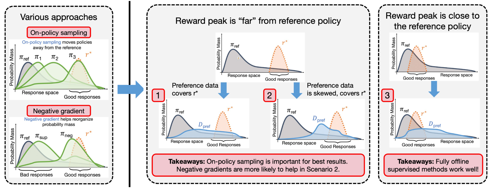



## Characterizing preference fine-tuning methods

Recall that the objective of typical preference fine-tuning procedures is:

$$
\max _{\pi_\theta} \mathbb{E}_{\boldsymbol{x} \sim \mathcal{D}_{\text {pref }}, \boldsymbol{y} \sim \pi_\theta(\cdot \mid x)}\left[r^*(\boldsymbol{x}, \boldsymbol{y})\right]-\beta \mathbb{D}_{\mathrm{KL}}\left[\pi_\theta(\cdot \mid \boldsymbol{x}) \| \pi_{\text {ref }}(\cdot \mid \boldsymbol{x})\right]
$$

Since access to ground-truth rewards is not scalable, most approaches use a surrogate reward model $r_\phi$. **Reward modeling is not the focus of this work.**

Existing approaches mainly differentiate in these aspects:

1. **on-policy sampling**: an explicit sampling of new responses from the policy (e.g., PPO, REINFORCE) or purely learning from offline data (e.g., RWR, DPO, IPO)
2. **on-policy sample reuse**: for only those approaches that perform on-policy sampling, whether the approach makes more than one gradient update on a given prompt-response$(x,y)$ pair (e.g., exactly 1 update for REINFORCE, ≥ 1 for PPO, online RWR)
3. **negative gradient**: whether the approach explicitly minimizes a loss that attempts to “pushdown” likelihood on certain responses by multiplying the gradient of their likelihood with a negative coefficient (e.g., contrastive methods such as DPO; RL methods REINFORCE, PPO)

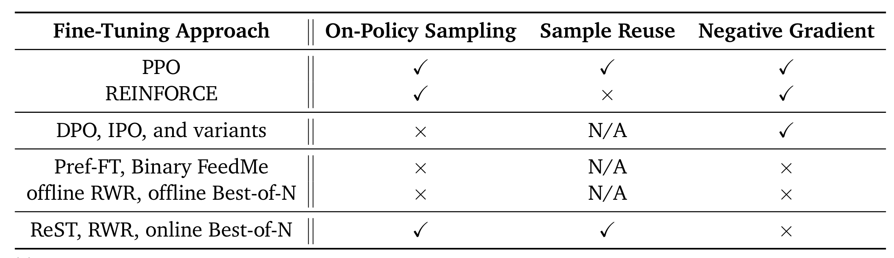

## Experiments

To systematically analyze the behavior of fine-tuning methods, a generic algorithmic framework is introduced:

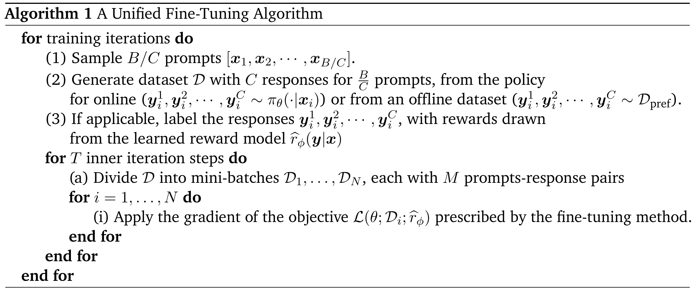

Notes:

1. To study **on-policy sampling**, we can vary the total number of samples $B$ used at each training iteration
2. For **sample reuse**, we can vary the number of gradient steps $T$ performed at each training iteration
3. **Negative gradient** depends on the specific fine-tuning method

### Setup

**Datasets and tasks**

1. Didactic bandit: simple bandit problem with controllable ground-truth reward function and combinatorial response space
2. Synthetic LLM: used to study the impact of coverage conditions and geometric relationships on different fine-tuning algorithms
3. Full-Scale LLM: real experiments on AlpacaFarm and UltraFeedback

**Coverage conditions and geometric relationships**

In synthetic LLM tasks, coverage conditions and geometric relationships are considered:

1. the geometric alignment between the ground-truth reward function $r^*$ and the reference policy $\pi_\mathrm{ref}$.
2. the coverage of the preference data used to train the surrogate reward model $r_\phi$ relative to the reference policy $\pi_\mathrm{ref}$.

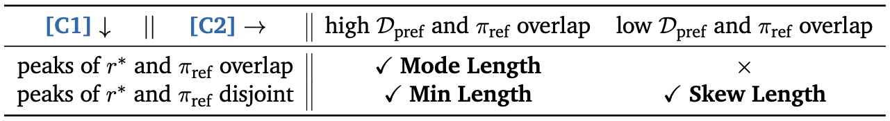

### Observation 1: On-policy sampling generally improves performance and efficiency

Sampling more frequently (smaller $B)$ shows clear performance improvements.

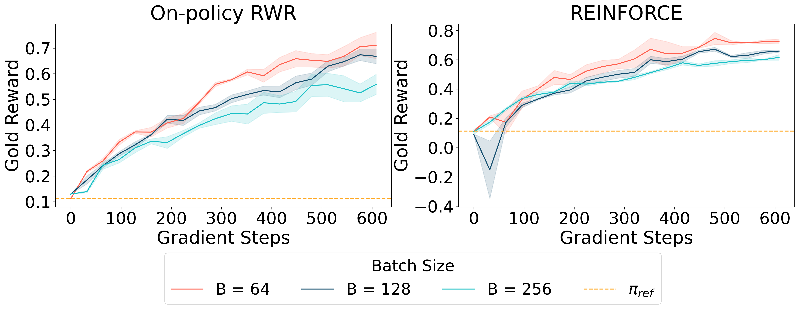

**Performance on AlpacaFarm with varying batch sizes.**

The improvement is more noticeable when the optimal policy is far away from the reference policy.

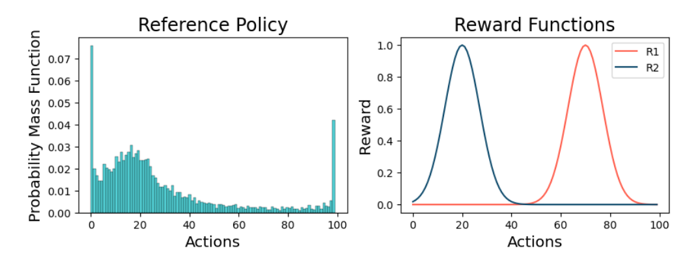

Didactic bandit problem.

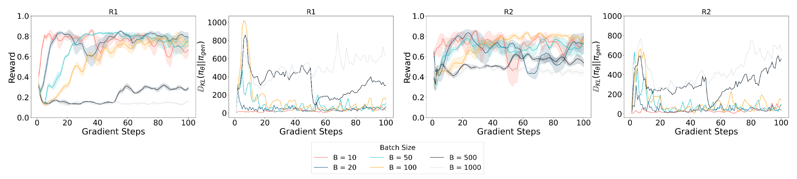

On-policy sampling on bandit problems.

### Observation 2: sample reuse can enable leveraging off-policy data

For PPO, some sample reuse can improve sample efficiency, but excessive sample reuse can hurt performance.

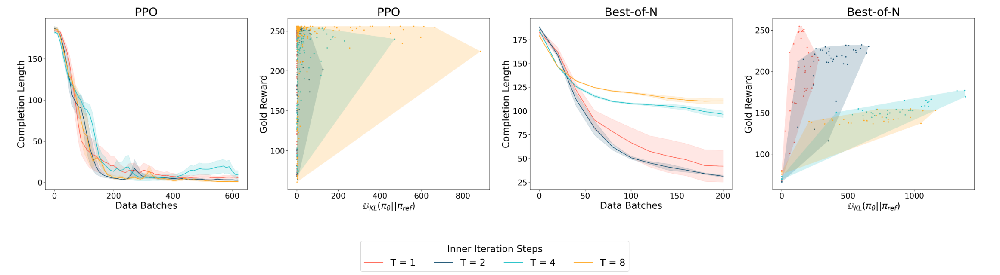

NOTE: PPO and best-of-N respond differently to sample reuse.

### Observation 3: negative gradient enables faster convergence

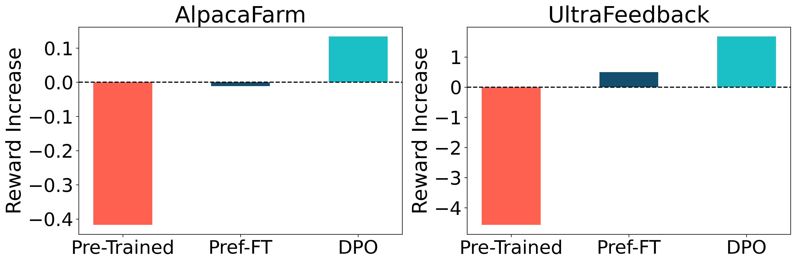

**Negative gradients in AlpacaFarm (left) and UltraFeedback (right).**

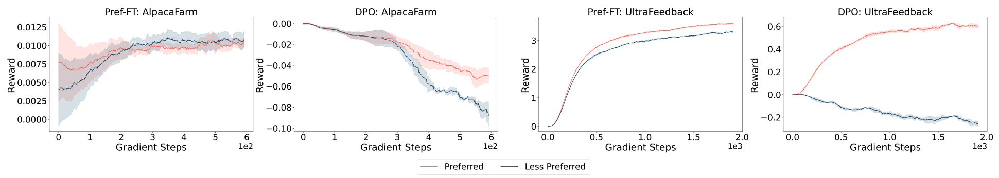

Negative gradients increases the gap between the likelihoods of preferred and dis-preferred responses.

### Observation 4: on-policy sampling and negative gradients are complementary

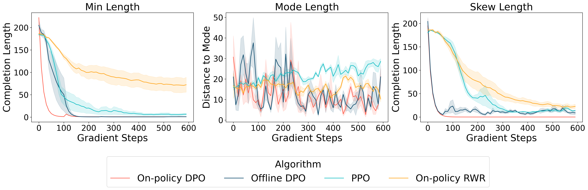

Online DPO performs the best where optimal policy and reference policy lies far from each other (min length and skew length), and all algorithms perform similarly when these two policies are close (mode length).

## Theoretical intuition: mode-seeking vs mode-covering

Main arguments:

1. on-policy algorithms are mode-seeking as they optimize the regularized reverse-KL objective
2. if the negative responses are chosen appropriately, then the contrastive update accelerates the rate of increase of probability mass on the preferred responses and exhibits mode-seeking behavior

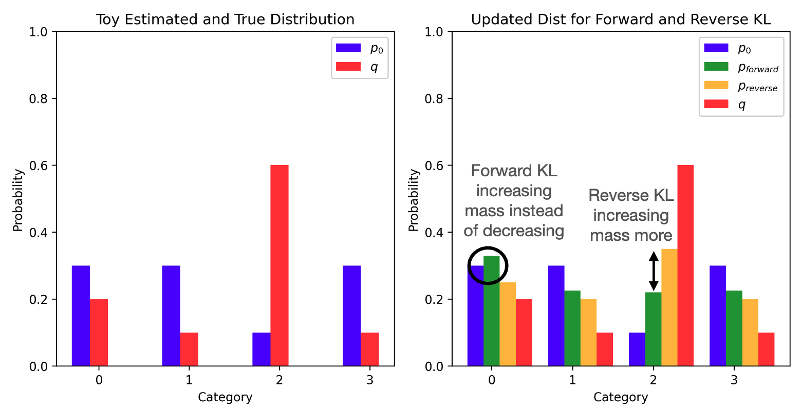

**Empirical Example contrasting mode-seeking (Reverse KL) and mode-covering (forward KL) objectives.**